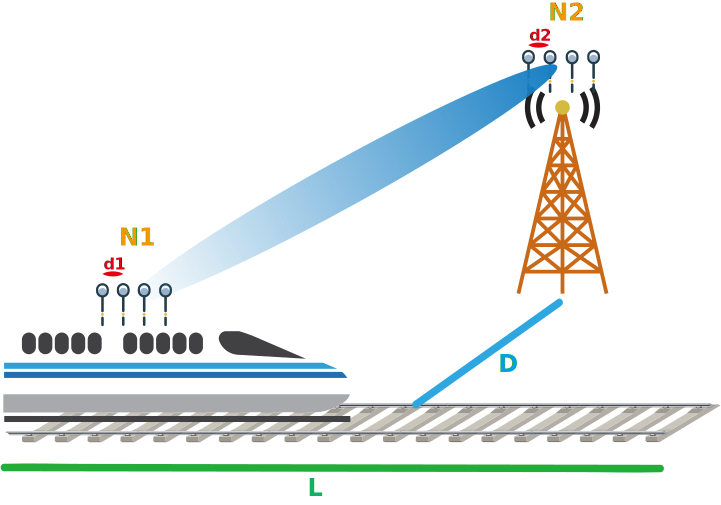

# HSRlearning
learn the signal features in HSR scenario with MATLAB + python

## descriptions

in HSR (high-speed railway) scenario, 350+km/h speed causes lots of problems to work with.

Basically we study the context as following:

- ~350km/h mobility
- MIMO
- beamforming

## outline

### 1. channel simulator

to briefly get some knowledge about the MIMO CSI, first try without multipath effect.

#### [T180907_HSR_CSI_NoMP](T180907_HSR_CSI_NoMP.md)

to generate a MATLAB window showing the CSI of static location, so there is no speed parameter

using static beam pattern, since no MP considered, we just use AoA beamforming.

